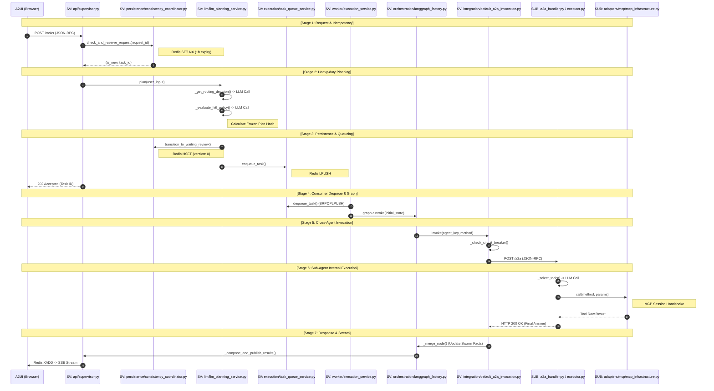

# 🛡️ Smart Supervisor Sub-Agent: 초정밀 기능 실행 흐름도 (Detailed Function Flow)

이 문서는 시스템의 UI 진입점부터 LLM API 호출, Redis 기반 비동기 큐잉, 워커 오케스트레이션, 그리고 서브에이전트의 MCP 도구 실행까지의 전 과정을 함수 및 로직 단위로 매핑한 마스터 명세서입니다.

---

## 📊 1. 전체 아키텍처 시각화 (Architecture Sequence)

---

## 📅 2. 마스터 상세 기능 명세 (Master Function Detail Table)

### [Part 1] Supervisor Agent: Producer (API & Planning)

| 단계 | 함수 (Function/Method) | 상세 로직 및 처리 내용 | 비고 |
| :--- | :--- | :--- | :--- |
| **S1-1** | `api/supervisor.py :: handle_supervisor_request` | 사용자의 `POST` 요청을 수신하여 `JsonRpcRequest` 모델로 바인딩 및 기본 스키마 검증. | 진입점 |
| **S1-2** | `supervisor_a2a_request_validator.py :: validate_request` | `session_id`, `message` 필수 필드 존재 여부 및 `request_id` 형식 검증. | 유효성검사 |
| **S1-3** | `supervisor_agent_service.py :: execute_task` | 태스크 라이프사이클 관리 시작. `coordinator`를 통해 중복 요청 여부 확인. | 오케스트레이션 |
| **S1-4** | `execution_consistency_coordinator.py :: check_and_reserve_request` | **[Redis CAS]** `set(lock_key, tid, nx=True, ex=3600)` 명령으로 동일 `request_id`에 대한 유일 실행 보장. | 멱등성락 |
| **S1-5** | `hitl_gate_service.py :: evaluate_and_open_review` | 입력 메시지에 대한 보안 검사 및 플래닝 프로세스 트리거. | 보안게이트 |
| **S1-6** | `prompt_injection_guard.py :: sanitize` | 정규표현식을 통해 `<script>`, `eval()`, SQL Injection 패턴 및 시스템 프롬프트 탈취 시도 필터링. | 인젝션방지 |
| **S1-7** | `llm_planning_service.py :: plan` | 사용 가능한 서브에이전트 목록을 로드하고 실행 계획 수립 시작. | 플래닝시작 |
| **S1-8** | `llm_planning_service.py :: load_agent_cards` | `supervisor.yml`에 등록된 에이전트의 `/.well-known/agent-card.json`을 HTTP Get으로 실시간 수집. | 에이전트탐색 |
| **S1-9** | `llm_planning_service.py :: _get_routing_decision` | **[LLM 호출]** `planning-system` 프롬프트를 사용하여 사용자 의도에 맞는 에이전트 호출 순서(DAG) 생성. | 실행계획수립 |
| **S1-10** | `llm_planning_service.py :: _evaluate_hitl_policy` | **[LLM 호출]** 생성된 계획의 위험도(예: 결제, 삭제)를 평가하여 인간 승인 필요 여부(`reviewRequired`) 결정. | 정책평가 |
| **S1-11** | `llm_planning_service.py :: _safe_parse_json` | LLM의 Markdown 응답에서 순수 JSON 블록을 추출하고 `FrozenExecutionPlan` 객체로 파싱. | 데이터추출 |
| **S1-12** | `canonical_json.py :: calculate_request_hash` | 원본 입력 파라미터를 Canonical JSON으로 정렬 후 SHA-256 해시 생성 (무결성 검증용). | 입력해싱 |
| **S1-13** | `canonical_json.py :: calculate_frozen_plan_hash` | 수립된 `routing_queue`와 `constraints`를 결합하여 계획 무결성 해시 생성. | 플랜해싱 |
| **S1-14** | `execution_consistency_coordinator.py :: transition_to_waiting_review` | **[Redis HSET]** 태스크 상태를 `WAITING_REVIEW`, `version`을 0으로 초기화하여 저장. | 상태영속화 |
| **S1-15** | `execution_consistency_coordinator.py :: persist_snapshot` | 승인 시점에 재검증할 수 있도록 `request_hash`, `plan_hash`를 포함한 스냅샷 저장. | 스냅샷저장 |
| **S1-16** | `task_queue_service.py :: enqueue_task` | 승인이 불필요한 경우 `Redis.lpush`를 통해 백그라운드 워커 큐(`supervisor:task_queue`)로 전송. | 큐잉 |
| **S1-17** | `openai_realtime_adapter.py :: _update_session` | **[Voice]** `prompts.yml`의 `stt-system` 지침을 로드하여 OpenAI Realtime 세션 설정. | 음성인식지침 |
| **S1-18** | `supervisor_agent_service.py :: _build_accepted_response` | 태스크 접수 완료 응답 생성. 승인 필요 시 `reason: HITL_REQUIRED` 포함. | 최종응답 |

### [Part 2] Supervisor Agent: Consumer (Worker & Execution)

| 단계 | 함수 (Function/Method) | 상세 로직 및 처리 내용 | 비고 |
| :--- | :--- | :--- | :--- |
| **S2-1** | `worker.py :: run_forever` | 다중 워커 프로세스를 기동하고 `_worker_loop` 비동기 태스크 실행. | 워커기동 |
| **S2-2** | `task_queue_service.py :: dequeue_task` | **[Reliable Queue]** `brpoplpush`를 사용하여 작업을 획득. `socket_timeout`은 20s로 설정되어 안전한 대기 보장. | 작업획득 |
| **S2-3** | `worker_execution_service.py :: _process_task` | 작업 유형 분류 및 실행 환경(Graph State) 초기화. | 실행준비 |
| **S2-4** | `worker_execution_service.py :: _process_task` | **[Direct Answer Check]** 단순 질의의 경우 그래프 오케스트레이션 없이 즉시 LLM 답변 생성 모드로 진입. | 최적화경로 |
| **S2-5** | `execution_consistency_coordinator.py :: start_approved_resume` | **[CAS 전이]** 태스크 상태를 `WAITING_REVIEW`에서 `RUNNING`으로 원자적 변경. 실패 시 즉시 중단. | 상태점검 |
| **S2-6** | `supervisor_graph_execution_service.py :: execute_plan` | LangGraph 기반의 복합 추론 및 다중 에이전트 오케스트레이션 엔진 가동. | 그래프엔진 |
| **S2-7** | `execution_consistency_coordinator.py :: load_swarm_state` | 해당 세션의 이전 대화 맥락과 공유 메모리(`SwarmState`)를 Redis에서 로드. | 지식로딩 |
| **S2-8** | `langgraph_factory.py :: _select_node` | 현재 실행 순번(`current_step_index`)을 확인하고 다음 호출할 서브에이전트 노드 결정. | 노드제어 |
| **S2-9** | `langgraph_factory.py :: _invoke_node` | 결정된 서브에이전트 노드에 진입하여 실제 호출 대행 서비스(`invocation_service`) 기동. | 노드실행 |
| **S2-10** | `default_a2a_invocation.py :: invoke` | 서브에이전트와의 외부 통신 및 장애 복구 로직 수행. | 대외호출 |
| **S2-11** | `default_a2a_invocation.py :: _check_circuit_breaker` | 대상 에이전트의 최근 실패율을 확인하여 임계값 초과 시 호출을 즉시 차단(Fail-Fast). | 회로차단 |
| **S2-12** | `default_a2a_invocation.py :: invoke` | **[Exponential Backoff]** 통신 실패 시 `initial-backoff-ms`부터 점진적으로 늘려가며 재시도 수행. | 재시도 |
| **S2-13** | `default_a2a_invocation.py :: invoke` | **[202 Accepted Handling]** 서브에이전트가 비동기 태스크 접수 시 응답 결과를 "접수됨"으로 매핑하여 흐름 유지. | 비동기대응 |
| **S2-14** | `default_a2a_invocation.py :: _update_circuit_breaker` | 호출 성공/실패 여부를 기록하여 회로 상태(Closed/Open) 갱신. | 상태피드백 |
| **S2-15** | `langgraph_factory.py :: _handoff_evaluate_node` | 서브에이전트의 응답을 분석하여 추가적인 핸드오프(Handoff) 요청이 있는지 검사. | 동적라우팅 |
| **S2-16** | `handoff_policy.py :: evaluate` | 핸드오프 요청 시 최대 홉(Hop) 수 제한 및 대상 에이전트 허용 여부 정책 검증. | 정책검증 |
| **S2-17** | `langgraph_factory.py :: _merge_node` | 서브에이전트들의 실행 결과와 새로운 지식을 `SwarmState`에 병합 및 업데이트. | 지식병합 |
| **S2-18** | `llm_compose_service.py :: stream_compose` | 모든 에이전트 실행 완료 후 최종 답변 생성. **[A2UI Early Check]** 로직 포함. | 결과합성 |
| **S2-19** | `supervisor_progress_publisher.py :: publish_chunk` | 답변 생성 중 발생하는 토큰을 `event: chunk`로 Redis Stream에 즉시 발행. | 실시간출력 |
| **S2-20** | `supervisor_progress_publisher.py :: publish_reasoning` | LLM의 사고 과정(`thought` 태그)을 추출하여 `event: reasoning`으로 별도 발행. | 투명성확보 |
| **S2-21** | `supervisor_progress_publisher.py :: publish_a2ui` | 서브에이전트 결과에 UI 메타데이터가 있을 경우 `event: a2ui`로 발행하여 즉시 렌더링 지시. | UI최적화 |
| **S2-22** | `execution_consistency_coordinator.py :: complete_execution` | **[CAS 전이]** 상태를 `COMPLETED`로 변경하고 최종 결과물을 JSON으로 영구 저장. | 작업종료 |

### [Part 3] Sub-Agent: Execution Deep-Dive (Producer-Consumer Pattern)

#### Phase 1: Task Publishing (Producer - API Layer)

| 단계 | 파일/함수 | 상세 로직 및 처리 내용 | 비고 |
| :--- | :--- | :--- | :--- |
| **A1-1** | `main.py :: a2a_router` | 슈퍼바이저의 POST 요청 수신. `JsonRpcRequest` 모델로 바인딩. | 진입점 |
| **A1-2** | `authorization_service.py :: assert_authorized` | `allowed_scopes`와 요청된 `scope` 비교. 권한 없으면 `SecurityException` 발생. | 보안 |
| **A1-3** | `a2a_handler.py :: handle_a2a_request` | `method_mapping`을 통해 `message/send`를 `SendMessage`로 정규화 및 본문 추출. | 규격화 |
| **A1-4** | `task_queue.py :: enqueue` | **[Task Publishing]** 실행에 필요한 컨텍스트(`session_id`, `task_id`, `message`)를 Redis Queue에 인큐. | 비동기전환 |
| **A1-5** | `a2a_handler.py :: handle_a2a_request` | 슈퍼바이저에게 `HTTP 202 Accepted` 응답과 `task_id`를 즉시 반환하여 커넥션 해제. | 호출종료 |

#### Phase 2: Task Consuming (Consumer - Background Worker)

| 단계 | 파일/함수 | 상세 로직 및 처리 내용 | 비고 |
| :--- | :--- | :--- | :--- |
| **A2-1** | `worker.py :: run_forever` | Redis `BRPOP` 또는 `XREAD`를 통해 큐에 쌓인 태스크를 지속적으로 폴링. | 워커루프 |
| **A2-2** | `worker.py :: _process_task` | 큐에서 꺼낸 메시지에서 `trace_id` 등을 복원하고 `AgentExecutor` 호출 준비. | 태스크인출 |
| **A2-3** | `executor.py :: execute` | `task_id`, `session_id`를 기반으로 실제 LangGraph 워크플로우 기동. | 실행시작 |
| **A2-4** | `redis_adapter.py :: update_status` | Redis에 해당 태스크의 상태를 `RUNNING`으로 업데이트. | 상태영속화 |
| **A2-5** | `agent_progress_publisher.py :: publish` | Redis Stream에 `PROGRESS` 이벤트 발행 (UI 실시간 갱신용). | 모니터링 |
| **A2-6** | `langgraph_factory.py :: _load_context` | 사용자 메시지를 `Message` 객체로 변환하여 대화 내역(History)의 첫 단추로 삽입. | 컨텍스트 |
| **A2-7** | `langgraph_factory.py :: _select_tools` | `McpToolRegistry.get_tool_schemas()`를 호출하여 사용 가능한 도구 목록 획득. | 도구탐색 |
| **A2-8** | `llm_adapters.py :: LlmPlanner.plan` | **[LLM 호출]** 도구 목록과 현재 메시지를 바탕으로 실행할 도구(Tool)와 파라미터 결정. | 의사결정 |
| **A2-9** | `llm_adapters.py :: LlmPlanner.plan` | LLM 응답에서 JSON 블록을 추출하고 `ToolPlan` 객체 리스트로 역직렬화. | 데이터변환 |
| **A2-10** | `langgraph_factory.py :: _execute_tools` | 생성된 `plans` 리스트를 루프 돌며 순차적 실행 시작. | 루프제어 |
| **A2-11** | `mcp_infrastructure.py :: get_session` | 도구 이름에 해당하는 MCP 서버의 `McpTransport` 인스턴스 획득. | 세션관리 |
| **A2-12** | `mcp_infrastructure.py :: call("initialize")` | MCP 서버와 **[Handshake]** 수행. 프로토콜 버전 및 클라이언트 정보 교환. | MCP 규격 |
| **A2-13** | `mcp_infrastructure.py :: call(tool_name)` | 실제 도구 파라미터를 JSON-RPC로 전송하여 비즈니스 로직 실행. | 도구실행 |
| **A2-14** | `mcp_infrastructure.py :: _parse_sse_response` | 서버의 `data:` 스트림 또는 JSON 응답에서 결과 페이로드 추출. | 응답파싱 |
| **A2-15** | `agent_progress_publisher.py :: publish` | 도구 실행 결과(`TOOL_RESULT`)를 Redis Stream에 발행. | 진행전파 |
| **A2-16** | `langgraph_factory.py :: _finalize_context` | 실행 결과를 `Message(role=tool)` 형태로 히스토리에 추가하여 문맥 완성. | 결과통합 |
| **A2-17** | `llm_adapters.py :: LlmComposer.stream_compose` | `compose-prompt-template`에 도구 실행 결과와 히스토리를 주입. | 답변준비 |
| **A2-18** | `llm_adapters.py :: LlmComposer.stream_compose` | **[LLM Stream 호출]** 실행 결과를 바탕으로 사용자에게 줄 최종 답변 생성. | 결과합성 |
| **A2-19** | `agent_progress_publisher.py :: publish` | 생성된 텍스트 청크(`CHUNK`)를 실시간으로 Redis Stream에 발행. | 스트리밍 |
| **A2-20** | `redis_adapter.py :: complete_task` | 최종 결과물과 상태(`COMPLETED`)를 Redis에 영구 저장. | 최종영속화 |

---

### [Part 4] Voice Integrated Orchestration (Pattern 3 Standard)

| 단계 | 파일/함수 | 상세 로직 및 처리 내용 | 비고 |
| :--- | :--- | :--- | :--- |
| **V1-1** | `api/supervisor.py :: websocket_voice_stream` | 브라우저로부터 오디오 스트림 수신. `session_id` 쿼리 파라미터 바인딩. | 음성진입점 |
| **V1-2** | `openai_realtime_adapter.py :: send_audio` | 수신된 PCM16 바이너리를 OpenAI Realtime API 규격에 맞춰 Base64로 인코딩 후 전송. | 오디오전달 |
| **V1-3** | `openai_realtime_adapter.py :: listen` | OpenAI로부터 실시간 전사 데이터(`text.delta`)를 수신하여 UI에 에코(Echo) 전송. | 실시간피드백 |
| **V1-4** | `api/supervisor.py :: send_loop` | **[Final Transcript 수신]** OpenAI의 최종 전사 완료 이벤트를 감지. | 인식완료 |
| **V1-5** | `supervisor_agent_service.py :: execute_task` | **[Server-Side Trigger]** 인식된 텍스트를 사용하여 즉시 에이전트 태스크 실행 트리거. | 통합오케스트레이션 |
| **V1-6** | `api/supervisor.py :: send_loop` | 생성된 `task_id`를 WebSocket을 통해 브라우저로 전송 (`task_started: true`). | 핸드셰이크 |
| **V1-7** | `app.js :: onVoiceTaskStarted` | 브라우저가 `task_id`를 수신하면 즉시 SSE 구독 모드로 전환하여 실시간 진행상황 표시. | SSE연결 |

---

## 🔐 3. 핵심 로직 게이트 및 제어점 (Logic Gates)

- **Idempotency Gate**: `coordinator.py`에서 `request_id` 중복 시 기존 생성된 `task_id`를 반환하여 중복 실행 방지.
- **HITL Policy Gate**: `llm_planning_service.py`에서 LLM이 `reviewRequired: true`를 반환할 경우, 작업을 중단하고 사용자의 `Decision (APPROVE/CANCEL)`을 대기.
- **Circuit Breaker Gate**: `default_a2a_invocation.py`에서 특정 에이전트 호출 실패가 임계값(`failure-threshold`)을 넘으면 일정 시간(`open-duration-ms`) 동안 호출을 즉시 차단.
- **A2UI Rendering Gate**: `llm_compose_service.py`에서 서브에이전트 응답에 `a2ui` 필드가 감지되면, 긴 텍스트 요약 대신 즉시 UI를 렌더링하고 스트림을 종료.
- **Voice-to-Task Gate**: `supervisor.py` WebSocket 핸들러에서 최종 전사가 완료되는 즉시 브라우저를 거치지 않고 서버 내부에서 태스크를 실행하여 지연 시간 최소화.

---
**Document Status**: 🔴 Ultra-Detailed / Finalized (Pattern 3 Applied)
**Last Refined**: 2026-05-04
